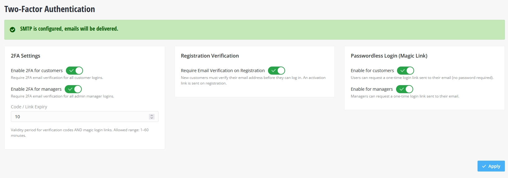
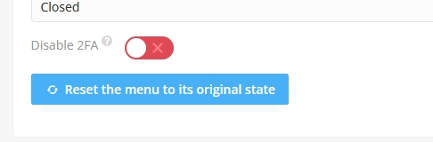
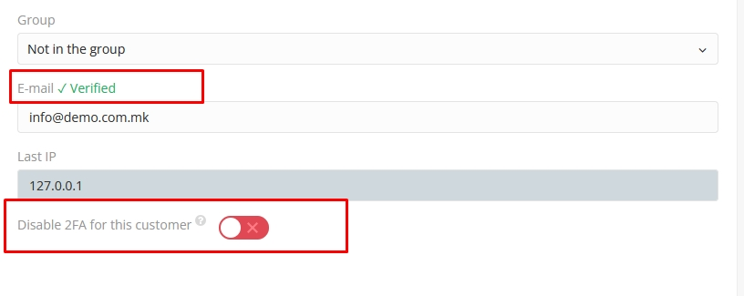
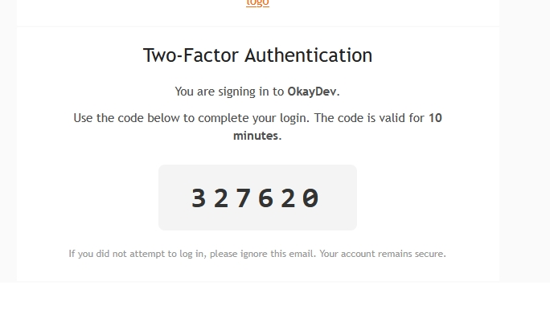
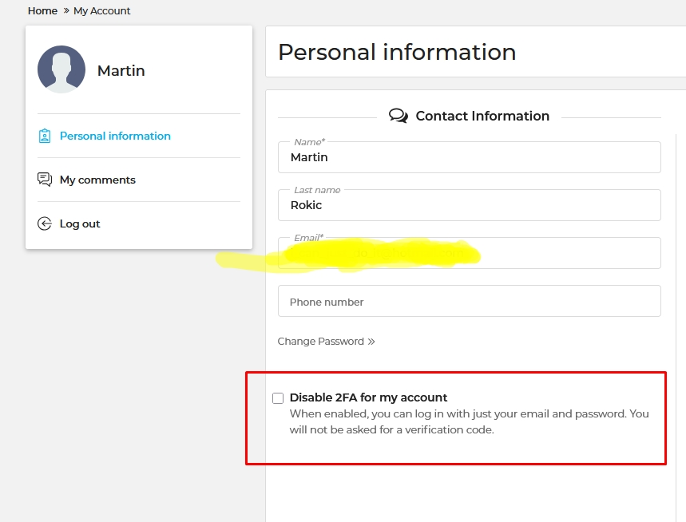
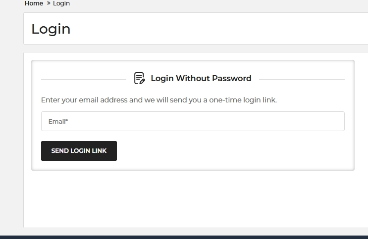
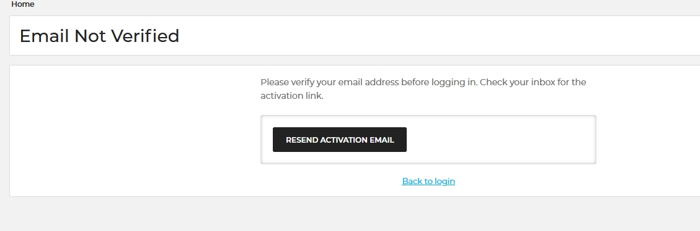
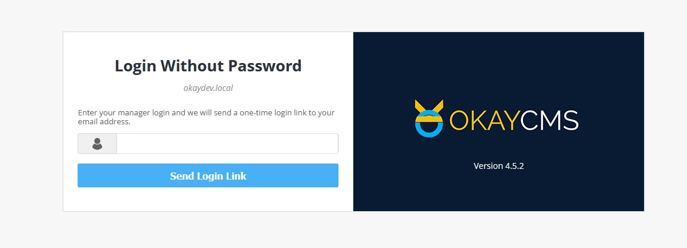
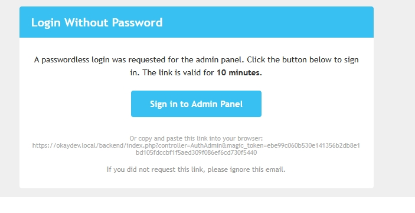
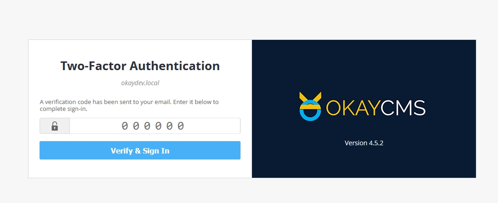

# Two Factor Authentication for OkayCMS

**Version:** 2.0.0
**OkayCMS:** 4.5.2+
**Author:** [RokaStudio](https://roka.mk) (me@roka.mk)
**Languages:** English, Russian, Ukrainian

## Features

- **Two-Factor Authentication** - email-based 6-digit code verification for both frontend customers and backend managers
- **Passwordless Login (Magic Link)** - one-click login via email link, no password required
- **Registration Email Verification** - require customers to verify their email before accessing their account
- **Email Change Re-verification** - automatically re-verify when a customer changes their email
- **Per-User / Per-Manager Override** - individually disable 2FA for specific accounts
- **Admin Settings Panel** - centralized configuration for all features

## Settings

| Setting | Default | Description |
|---------|---------|-------------|
| Enable 2FA for customers | On | Require 6-digit code on customer login |
| Enable 2FA for managers | On | Require 6-digit code on admin login |
| Code / Link Expiry | 10 min | Validity period for codes and magic links (1–60 min) |
| Require Email Verification | Off | Customers must verify email after registration |
| Passwordless Login (customers) | Off | Allow magic-link login for customers |
| Passwordless Login (managers) | Off | Allow magic-link login for managers |





## How It Works

### Frontend Login with 2FA

1. Customer enters email and password on the login page
2. If credentials are valid and 2FA is enabled, the login form transforms into a code entry field
3. A 6-digit code is sent to the customer's email
4. Customer enters the code and is logged in





### Frontend Passwordless Login

1. When enabled, the login form is replaced with a single email field
2. Customer enters their email and receives a one-time login link
3. Clicking the link logs them in immediately



### Registration Verification

1. When enabled, new customers receive an activation email after registration
2. The customer is redirected to a "verify your email" page (no auto-login)
3. Clicking the activation link verifies the account
4. The customer can then log in normally



### Email Change

1. When a logged-in customer changes their email, the account is marked as unverified
2. An activation email is sent to the new address
3. The customer is logged out and must verify the new email before logging in again


### Backend Login with 2FA

1. Manager enters login and password on the admin auth page
2. If 2FA is enabled, a modal appears asking for the 6-digit code
3. A code is sent to the manager's email
4. Manager enters the code and is authenticated





## Routes

| URL | Description |
|-----|-------------|
| `/account/activate?token=...` | Email activation link handler |
| `/account/not-verified` | Email verification pending page |
| `/account/magic-link?token=...` | Magic-link login handler |

## Database

### Table: `__rs_tfa_tokens`

| Column | Type | Description |
|--------|------|-------------|
| id | int(11) | Primary key, auto-increment |
| token | varchar(64) | Unique token (hex) |
| type | varchar(20) | `verify_reg`, `magic_user`, or `magic_admin` |
| user_id | int(11) | Associated customer ID (nullable) |
| manager_login | varchar(64) | Associated manager login (nullable) |
| expires_at | int(11) | Expiration timestamp |
| created_at | int(11) | Creation timestamp |

### Fields added to `__users`

| Column | Type | Default | Description |
|--------|------|---------|-------------|
| rs_tfa_disabled | tinyint(1) | 0 | Per-user 2FA disable flag |
| rs_tfa_email_verified | tinyint(1) | 1 | Email verification status |

### Fields added to `__managers`

| Column | Type | Default | Description |
|--------|------|---------|-------------|
| rs_tfa_disabled | tinyint(1) | 0 | Per-manager 2FA disable flag |

## Template Modifications (module.json)

No core files are modified. All template changes are injected via `module.json`:

**Backend:**
- `manager.tpl` - 2FA disable toggle on manager edit page
- `user.tpl` - email verification status and 2FA disable toggle on user edit page
- `auth.tpl` - 2FA code modal and magic-link UI on admin login

**Frontend:**
- `user.tpl` - email verification notice and 2FA disable checkbox on profile page
- `login.tpl` - 2FA code input and magic-link form on login page

## Chain & Queue Extensions

### Chain Extensions

| Hook | Handler | Purpose |
|------|---------|---------|
| `ValidateHelper::getUserLoginError` | `FrontExtender::skipLoginValidation` | Bypass validation for 2FA/magic requests |
| `UserHelper::login` | `FrontExtender::interceptLogin` | Handle 2FA flow, magic-link, code verification |
| `UserHelper::register` | `RegistrationExtender::interceptRegister` | Block auto-login when email verification is on |
| `UserRequest::postProfileUser` | `FrontExtender::extendProfileUser` | Process `rs_tfa_disabled` checkbox |
| `UsersEntity::add` | `RegistrationExtender::afterUserAdd` | Send activation email on registration |
| `UsersEntity::get` | `RegistrationExtender::cacheUserEmail` | Cache email for change detection |
| `UsersEntity::update` | `RegistrationExtender::afterUserUpdate` | Detect email change, re-verify |

### Queue Extensions

| Hook | Handler | Purpose |
|------|---------|---------|
| `AuthAdmin::fetch` | `BackendExtender::interceptAdminAuth` | Admin 2FA and magic-link flow |
| `ManagerAdmin::fetch` | `BackendExtender::updateTfa` | Per-manager 2FA toggle |
| `UserAdmin::fetch` | `BackendExtender::updateTfaUser` | Per-user 2FA and verification toggle |

## File Structure

```
TwoFactorAuthentication/
├── Init/
│   ├── Init.php
│   ├── module.json
│   ├── routes.php
│   ├── services.php
│   └── SmartyPlugins.php
├── Helpers/
│   └── TwoFaHelper.php
├── Extenders/
│   ├── FrontExtender.php
│   ├── BackendExtender.php
│   └── RegistrationExtender.php
├── Controllers/
│   ├── ActivateController.php
│   ├── NotVerifiedController.php
│   └── MagicLoginController.php
├── Entities/
│   └── TwoFaTokensEntity.php
├── Plugins/
│   ├── TfaCheckboxPlugin.php
│   └── EmailVerifyNoticePlugin.php
├── design/
│   ├── html/
│   │   ├── tfa_login.tpl
│   │   ├── activate_notice.tpl
│   │   ├── not_verified.tpl
│   │   ├── magic_login.tpl
│   │   ├── user_tfa_checkbox.tpl
│   │   ├── email_verify_notice.tpl
│   │   └── email/
│   │       ├── email_2fa_user.tpl
│   │       ├── email_activation.tpl
│   │       └── email_magic_login_user.tpl
│   └── lang/
│       ├── en.php
│       ├── ru.php
│       └── ua.php
├── Backend/
│   ├── Controllers/
│   │   └── TwoFaAdmin.php
│   ├── design/html/
│   │   ├── tfa_admin.tpl
│   │   ├── tfa_auth.tpl
│   │   ├── manager_block.tpl
│   │   ├── tfa_user_block.tpl
│   │   ├── email_verify.tpl
│   │   └── email/
│   │       ├── email_2fa_admin.tpl
│   │       └── email_magic_admin.tpl
│   └── lang/
│       ├── en.php
│       ├── ru.php
│       └── ua.php
└── README.md
```

## Security

- **Constant-time comparison** - `hash_equals()` for code verification to prevent timing attacks
- **User enumeration prevention** - magic-link endpoints always show the same success message
- **Cryptographic tokens** - 64-character hex tokens from `random_bytes(32)`
- **Configurable TTL** - codes and links expire after the configured period
- **Session isolation** - separate session keys for user and admin 2FA flows

## Requirements

- OkayCMS 4.5.2 or higher
- SMTP must be configured for email delivery (the module shows a warning if not configured)

## Installation

1. Copy the `TwoFactorAuthentication` folder to `Okay/Modules/RokaStudio/`
2. Go to the admin panel and activate the module
3. Configure settings in the module's admin page
